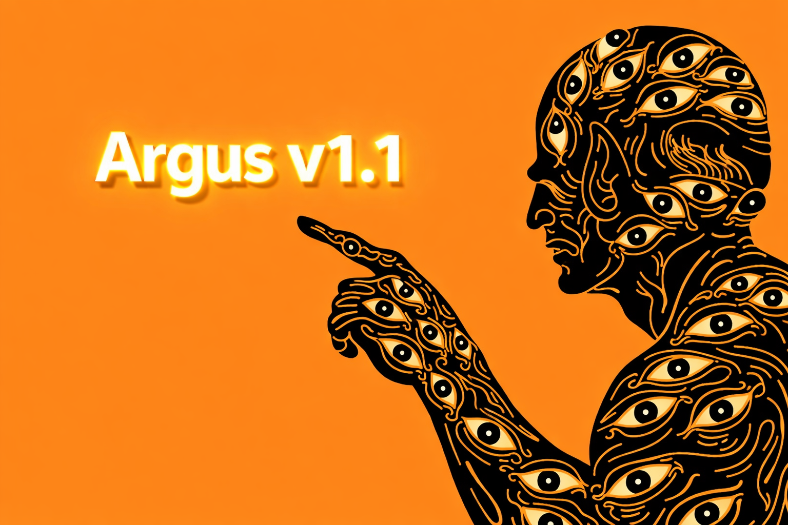

<p align="center">
  
  
</p>

### Seizure Detection for Continuous EEG Monitoring

[](https://www.python.org/downloads/)
[](https://pytorch.org/)
[](https://opensource.org/licenses/MIT)
[](https://github.com/stevehaworth02/Argus)

With much more to come, Argus, inspired by the all-seeing giant of Greek mythology, provides continuous monitoring, detection, and artifact classification for detection of abnormal patterns in EEG recordings. This system achieves **98.06% ROC-AUC** on the Temple University Hospital EEG Seizure Corpus using a CNN-LSTM architecture, designed for real-time deployment on portable EEG devices.

---

## Results

| Metric | Score | Interpretation |
|--------|-------|----------------|
| **ROC-AUC** | **0.9806** | Excellent discrimination between seizure and background activity |
| **Sensitivity** | **95.88%** | Detects 2,305 out of 2,404 seizures (4.1% miss rate) |
| **Specificity** | **92.30%** | 7.7% false positive rate (1,062 false alarms per 13,800 windows) |
| **Accuracy** | **92.84%** | Overall classification accuracy |
| **NPV** | **99.23%** | High confidence in negative predictions |

**Model Efficiency:** 1.25M parameters, 4.79 MB size, <100ms inference time (CPU)

---

## Architecture

<!-- PUT YOUR PPT DIAGRAM HERE -->
<!--  -->

**CNN-LSTM Hybrid Design**

The model combines spatial feature extraction with temporal sequence modeling:

**Feature Extraction (CNN)**
- Multi-scale temporal convolutions (kernel sizes: 7, 11, 15)
- Residual connections for training stability
- Batch normalization and dropout (0.4)
- Progressive max pooling (4x reduction per block)

**Temporal Modeling (LSTM)**
- Bidirectional LSTM (2 layers, 128 hidden units)
- Captures forward and backward temporal context
- Dropout between layers for regularization

**Attention & Classification**
- Temporal attention mechanism learns to focus on seizure onset patterns
- Fully connected layers with dropout
- Binary classification output (seizure probability)

---

## Quick Start

### Installation
```bash
